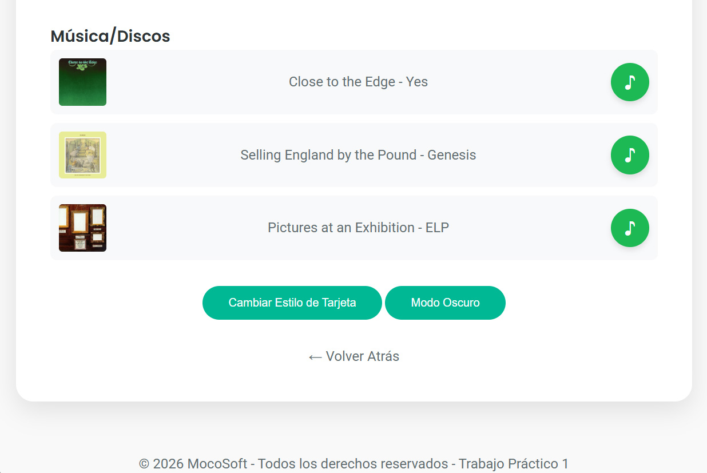
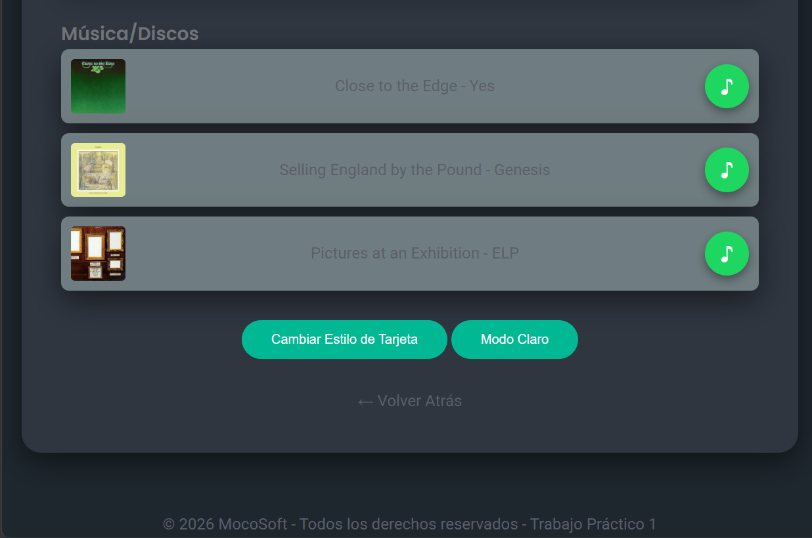
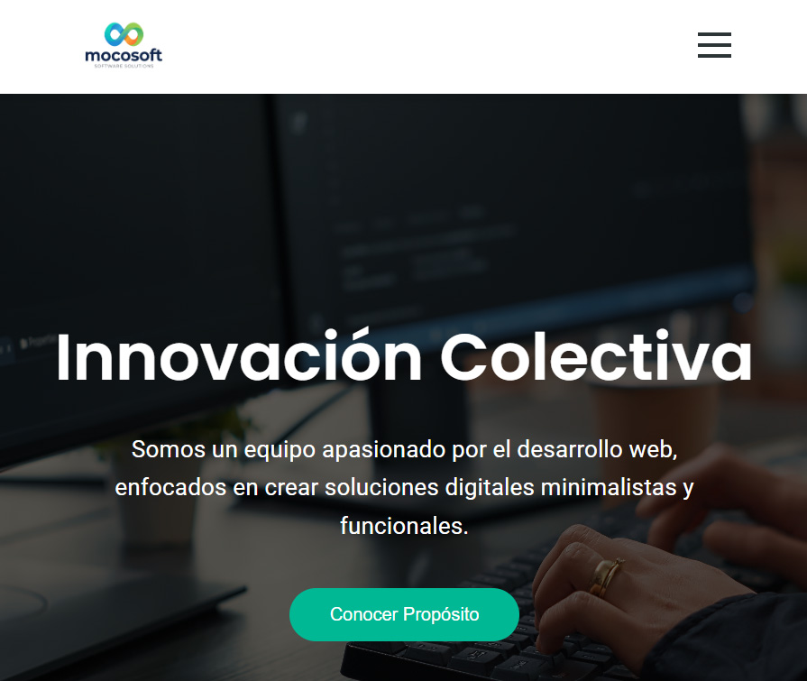
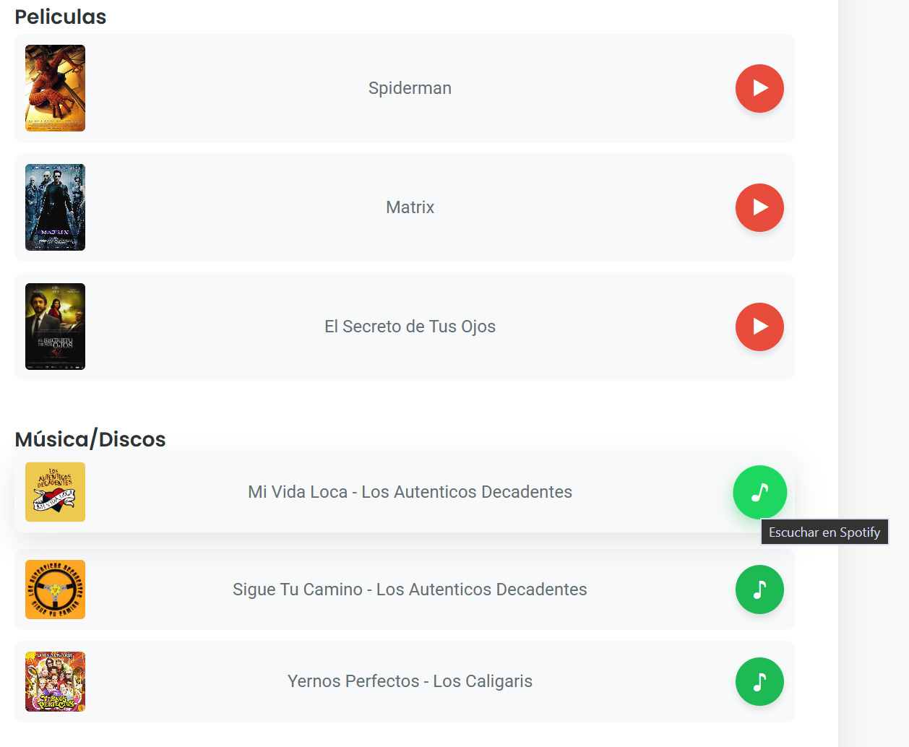
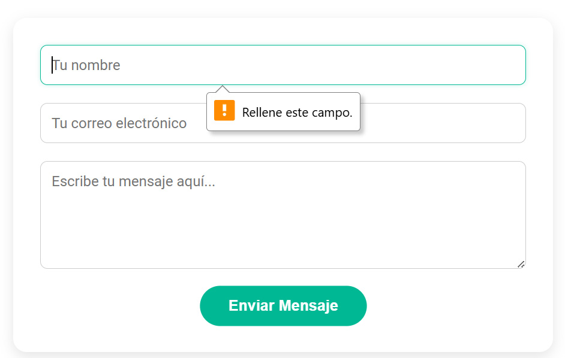
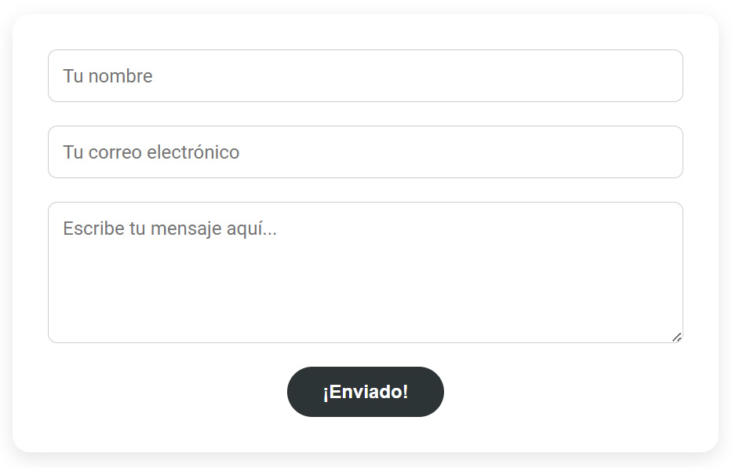

# Front_TP1_Grupal
Trabajo Práctico Grupal 1  Proyecto Web en Equipo
 
# Equipo "MocoSoft"

Bienvenido al repositorio oficial del Proyecto MocoSoft. Este sitio web ha sido desarrollado como parte del Trabajo Práctico N°1 de la Tecnicatura Superior en Desarrollo de Software.

## Enlaces_del_Proyecto
Sitio en Vivo (Vercel): front-tp-1-grupal.vercel.app

Repositorio: GitHub - SergioDanielGalvan/Front_TP1_Grupal

## Integrantes_del_Equipo
Alejandro Rodriguez: Maquetación en html, lógica de Modo Oscuro y gestión de contenido multimedia.

Sergio Daniel Galván: Creación de repositorio, optimización de recursos gráficos y desarrollo de secciones de perfil.

Víctor Álvarez: Desarrollo de página de contacto y lógica de validación de formularios.

## Tecnologías_y_Herramientas
Para este proyecto se utilizaron estándares modernos de desarrollo web:

HTML5 Semántico: Uso de etiquetas como <header>, <main>, <nav>, <section> y <table> para asegurar accesibilidad y SEO.

CSS3 Avanzado: Uso de Variables CSS (:root), Flexbox para el diseño responsivo y transiciones suaves.

JavaScript:

Manipulación del DOM para interactividad.

Uso de localStorage para persistencia del Modo Oscuro.

Gestión de eventos (addEventListener) para formularios y menús.

Control de Versiones: Git & GitHub (flujo de trabajo colaborativo mediante ramas y Pull Requests).

## Funcionalidades_Destacadas
Modo Oscuro Persistente: El usuario puede cambiar el tema del sitio, y su preferencia se guarda en el navegador para futuras visitas.
| Modo Claro | Modo Oscuro |
| :---: | :---: |
|  |  |

Menú Hamburguesa: Navegación optimizada para dispositivos móviles (Responsive Design).
| Menu Responsive | Menu |
| :---: | :---: |
|  |  |

Bitácora Integrada: Un registro detallado de la evolución del proyecto accesible desde el menú principal.

Galería Multimedia: Integración dinámica de trailers de cine y pistas de audio (Spotify/YouTube).
| Menu Responsive |
| :---: |
|  |

Formularios Inteligentes: Validación de campos y limpieza automática tras el envío exitoso.
| Contac Val | Contact Send |
| :---: | :---: |
|  |  |

## Estructura del Repositorio
/
├── index.html          # Página principal
├── bitacora.html       # Registro de acciones
├── contact.html       # Formulario de contacto
├── sergiogalvan.html   # Perfil de Sergio
├── victoralvarez.html  # Perfil de Víctor
├── alejandrorodriguez.html # Perfil de Alejandro
├── css/
│   └── style.css         # Estilos globales
├── js/
│   └── main.js         # Lógica de Modo Oscuro y botones
├── img/                # Organizado en /disc y /film
└── README.md           # Este documento

## Nota_del_Equipo
Este proyecto refleja la capacidad de trabajo colaborativo y la aplicación de conceptos de desarrollo frontend modernos, priorizando siempre la experiencia del usuario y la legibilidad del código.